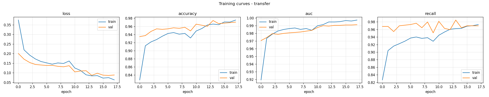
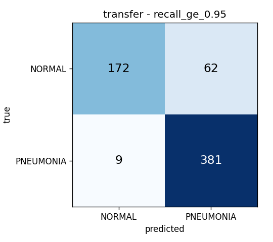
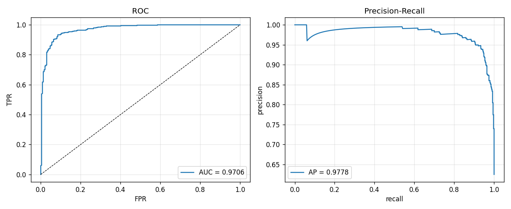
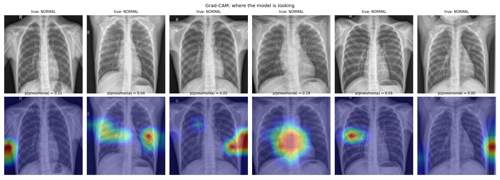

# Problem Set 01 — Pneumonia Detection from Paediatric Chest X-Rays

A convolutional neural network that classifies anterior-posterior chest radiographs
as **NORMAL** or **PNEUMONIA**. The images come from paediatric patients aged one to
five and were captured as part of routine clinical care.

---

## 1. Dataset

5,856 JPEG radiographs, split across three folders, each with one subfolder per class.
(The problem statement quotes 5,863; the archive as supplied contains 5,856 once the
macOS metadata files are removed.)

| Split | NORMAL | PNEUMONIA | Total |
|---|---|---|---|
| train | 1,341 | 3,875 | 5,216 |
| val   | 8     | 8     | 16    |
| test  | 234   | 390   | 624   |

Three properties of this data drove most of the design decisions:

**The archive was zipped on macOS.** It contains a `__MACOSX/` directory and
`.DS_Store` files. `image_dataset_from_directory` and `ImageFolder` walk directories
without filtering, so `__MACOSX` gets picked up as a third class and `.DS_Store`
raises a decode error. `prepare_data.py` strips them before anything else runs.

**The provided validation set has 16 images.** Validation accuracy can therefore only
take 17 distinct values, in steps of 6.25%. Early stopping or threshold selection on
that signal is essentially coin-flipping. The pipeline instead holds out a random 15%
of `train/` as the working validation set, and reports the original `val/` separately
at the end purely as a sanity check.

**The training set is ~2.9:1 imbalanced** toward pneumonia. Unweighted cross-entropy
drifts toward the majority class, and the test set is 62.5% pneumonia, so a model that
predicts "pneumonia" for everything already scores 62.5% accuracy. Inverse-frequency
class weights are applied, and accuracy is deliberately not the headline metric.

---

## 2. Approach

Two models, so there is something to compare against.

**Baseline CNN (from scratch).** Four VGG-style blocks (32 → 64 → 128 → 256 filters),
each two 3×3 convolutions with batch normalisation and ReLU followed by max-pooling,
then global average pooling and a dropout-regularised dense head. Global average
pooling rather than `Flatten` keeps the parameter count around 1.2M, which matters
with only ~4,400 training images.

**MobileNetV2 transfer learning.** ImageNet weights, backbone frozen, new sigmoid head.
Trained in two stages: first the head alone at lr=1e-3, then the top 40 backbone layers
unfrozen at lr=1e-5. BatchNorm layers stay frozen throughout — letting their running
statistics update on a small dataset at batch size 32 is a reliable way to destroy a
pretrained backbone. MobileNetV2 was chosen over ResNet50 because it trains in a few
minutes on a single GPU and, on a dataset this size, the extra capacity of a larger
backbone mostly buys overfitting.

Images are resized to 224×224 and loaded as 3-channel RGB. The radiographs are
grayscale, but duplicating the channel is what lets ImageNet weights be used at all,
and the cost is negligible.

**Augmentation:** small rotation (±5%), zoom (±10%), translation (±5%) and contrast
jitter (±10%). Note there is **no horizontal flip**, which most tutorials include. A
mirrored chest X-ray depicts situs inversus, an anatomy the model will never encounter
at inference, and it destroys the left/right asymmetry — heart shadow on the left,
gastric bubble below it — that carries real diagnostic signal. Rotation is kept small
because AP paediatric films follow a fairly standardised positioning protocol.

**Threshold selection.** The 0.5 default is arbitrary. Two thresholds are chosen on the
validation split (never on test): the F1-maximising one, and the lowest threshold that
keeps pneumonia recall at or above 0.95. The second is the operationally meaningful
one — a missed pneumonia in a five-year-old is a materially worse outcome than a false
positive that a radiologist reviews and overrules.

**Interpretability.** Grad-CAM overlays are generated for a batch of test images. A
model that scores 95% while attending to the image border, a text annotation, or a
scanner artefact is not a model anyone should deploy, and this dataset is known to
contain such shortcuts.

---

## 3. How to run

```bash
pip install -r requirements.txt

# 1. unpack, strip macOS junk, print class counts
python src/prepare_data.py --zip ~/Downloads/Archive.zip --out data/

# 2. train (transfer learning is the recommended run)
python src/train.py --data-dir data --model transfer --epochs 15
python src/train.py --data-dir data --model baseline --epochs 25

# 3. evaluate: thresholds, confusion matrices, ROC/PR curves, Grad-CAM
python src/evaluate.py --data-dir data --model-path outputs/models/transfer.keras
```

Two notebooks are provided in `notebooks/`:

* `run_on_colab.ipynb` — the notebook actually used to produce the results below, on a
  Colab T4 GPU. On CPU the transfer model takes roughly an hour rather than a few
  minutes, so the reported run was done on GPU.
* `pneumonia_cnn.ipynb` — the same pipeline expressed cell by cell, for stepping
  through the code locally.

The dataset is **not** committed to this repository — see `.gitignore`. It is ~1.2 GB
and available from Kaggle (Chest X-Ray Images, Pneumonia — Kermany et al.).

---

## 4. Results

Both models were trained on a Colab T4. The transfer model stopped early at epoch 18
and restored the weights from epoch 12, its best validation PR-AUC.

### Test set, n = 624 (234 NORMAL, 390 PNEUMONIA)

| Metric | Baseline CNN | MobileNetV2 transfer |
|---|---|---|
| Accuracy @ 0.5 | 0.8718 | **0.8734** |
| Precision (pneumonia) | 0.8523 | 0.8388 |
| **Recall (pneumonia)** | 0.9615 | **0.9872** |
| Specificity (normal) | **0.7222** | 0.6838 |
| F1 (pneumonia) | 0.9036 | **0.9069** |
| ROC-AUC | 0.9424 | **0.9706** |
| PR-AUC | 0.9577 | **0.9778** |
| Missed pneumonia cases (FN) | 15 | **5** |
| Val threshold, max F1 | 0.022 | 0.350 |
| Val threshold, recall ≥ 0.95 | 0.205 | 0.672 |

The baseline CNN's own threshold sweep: 0.8718 accuracy at 0.5, 0.7548 at its
F1-optimal 0.022, and 0.8510 at its recall-constrained 0.205.

### Effect of the decision threshold (MobileNetV2)

Thresholds were selected on the held-out validation split, never on test.

| Threshold | Source | Accuracy | Recall | Specificity | Precision | FN | FP |
|---|---|---|---|---|---|---|---|
| 0.500 | default | 0.8734 | 0.9872 | 0.6838 | 0.8388 | 5 | 74 |
| 0.350 | max F1 on val | 0.8494 | 0.9923 | 0.6111 | 0.8096 | 3 | 91 |
| **0.672** | **recall ≥ 0.95 on val** | **0.8862** | **0.9769** | **0.7350** | **0.8600** | **9** | **62** |

Confusion matrix at the recommended threshold of 0.672:

```
                 predicted
               NORMAL  PNEUMONIA
true NORMAL      172       62
     PNEUMONIA     9      381
```

### Original val/ folder (16 images)

Accuracy 0.6875, ROC-AUC 0.9844. Reported only to show why it was not used for model
selection — see the findings below.






---

## 5. Findings

**Validation accuracy overstates test accuracy by roughly ten points.** The model
reached 0.9706 validation accuracy but 0.8734 on test. Since the validation split is
drawn from the same pool as training, this gap is not simple overfitting — it points
to a distribution shift between the train and test folders, which appear to have been
collected or graded under somewhat different conditions. A model tuned only against
its own validation split would have looked considerably better than it is.

**The errors are almost entirely one-sided.** At the default threshold the model
recovers 98.7% of pneumonia cases but only 68.4% of normal ones: 74 of 234 healthy
children are flagged. Reporting accuracy alone hides this completely. Two causes
compound — training is 74% pneumonia even after class weighting, and pneumonia
presents as visible opacity while "normal" is defined by the absence of a finding,
which is the harder pattern to learn.

For a screening application this is the preferable direction to err in. A false
positive costs a radiologist a second look; a false negative sends home a
five-year-old with untreated pneumonia. But it should be a stated design choice, not
an accident of the class distribution.

**Transfer learning wins on ranking, not on headline accuracy.** The two models are
within 0.2 points on accuracy — 0.8718 against 0.8734 — which on a 624-image test set
is a single image and means nothing. The separation shows up in the threshold-free
metrics: ROC-AUC 0.9424 against 0.9706, PR-AUC 0.9577 against 0.9778. MobileNetV2
orders cases better, and it missed 5 pneumonias to the baseline's 15, a third as many.
Anyone comparing these two on accuracy alone would have concluded, wrongly, that
ImageNet pretraining bought nothing here.

**The baseline is badly calibrated.** Its F1-optimal threshold landed at 0.022 and its
recall-constrained one at 0.205, against 0.350 and 0.672 for the transfer model. A
network whose useful operating point sits near zero is producing scores bunched hard
against one end of the range. The transfer model's thresholds sit in a sane region,
which matters if anyone downstream wants to read its output as something like a
confidence.

**Ranking quality is good; thresholding is the weak point.** ROC-AUC of 0.9706 and
PR-AUC of 0.9778 say the model orders cases well. The much lower accuracy of 0.8734
says the default cut-point of 0.5 sits badly. Moving the threshold to 0.672 lifted
accuracy to 0.8862 and specificity from 0.684 to 0.735, cutting false alarms from 74
to 62 at the cost of four additional missed cases. That is a larger swing than most
architecture changes would produce, from a single scalar.

**Maximising F1 was the wrong objective here.** The F1-optimal threshold of 0.350 is
*below* the default, pushing the model further toward its already-dominant positive
class. It reduced test accuracy to 0.8494 and specificity to 0.6111. Because F1 is
computed on the positive class only, and the positive class is the majority, F1 is not
a safe thing to optimise on this dataset. The recall-constrained threshold is the one
to report.

**The supplied 16-image validation set is unusable.** It scored 0.6875, wildly out of
line with the 624-image test set, because it misclassified 5 of 8 normal images and
each image is worth 6.25%. Any early stopping or threshold choice made against it
would have been noise. Holding out 15% of train instead gave 782 validation images and
a stable signal.

**Training dynamics separate the two models more clearly than the metrics do.** The
transfer model's curves are smooth and monotone, with train and validation tracking
each other throughout. The baseline's validation curves are violent: loss spikes above
5.0 at epoch 4, and validation accuracy collapses from 0.95 to 0.65 in a single epoch
at 16 before recovering. Training accuracy meanwhile climbs steadily to 0.97. A model
whose held-out performance can swing 30 points between consecutive epochs is not
converged in any useful sense — whatever it settles on depends heavily on where
early stopping happens to land. The pretrained backbone removed that instability
entirely.

One detail in the transfer curves is expected rather than anomalous: validation
accuracy sits *above* training accuracy for the first ten epochs. Augmentation and
dropout are active during training and disabled at validation, so the model is being
scored on an easier version of the task. It is not a data leak.

**Grad-CAM is the least reassuring result here.** Generated for the transfer model
only; the baseline has no nested pretrained backbone to hook into. Two observations
from `outputs/gradcam_transfer.png`:

Attention is not consistently anatomical. In two of the six panels the hottest region
sits on the left or right image border, outside the thorax entirely — on background,
not tissue. Of the panels that do attend inside the chest, most focus on the
mediastinum, hilar region or cardiac silhouette rather than the peripheral lung fields
where consolidation actually appears. Only one panel shows broad upper-zone lung
coverage.

That said, this panel is weak evidence in both directions, for two reasons. The test
loader is unshuffled, so the first batch is entirely NORMAL — every image shown is a
confident negative, with p(pneumonia) between 0.00 and 0.19. Grad-CAM on a
confidently-negative example has very little gradient signal to work with, and the map
is min-max normalised before display, so near-zero noise gets stretched to full colour
range. The border blobs may be amplified noise rather than genuine reliance on
background. A fair assessment needs the same visualisation over positive cases, which
is the obvious next step.

What can be said is that this panel does not *demonstrate* the model is reading
radiographic signs. Given a headline accuracy of 0.886, that gap between performance
and evidence of sound reasoning is exactly the thing that should block deployment
until it is resolved.

---

## 6. Limitations

- Single-source data from one hospital, one age band (1–5), one projection (AP). It
  should not be expected to generalise to adults, to PA films, or to other scanners.
- Binary NORMAL/PNEUMONIA only. The filenames encode `virus` and `bacteria`
  (see `person1_virus_6.jpeg`), so a three-class version is a natural extension.
- Labels come from the original dataset's grading process; no independent
  re-adjudication was performed here.
- The held-out test set is 624 images, so a 1% difference in accuracy is roughly six
  images and should not be over-interpreted.
- This is a coursework model. It is a triage aid at best and not a diagnostic device.
- The Grad-CAM panel samples the first test batch only, which is entirely NORMAL
  because the test loader is unshuffled. Interpretability was therefore only assessed
  on negative cases. Repeating it over pneumonia-positive images, where the gradient
  signal is strong, is required before drawing conclusions about what the model reads.
